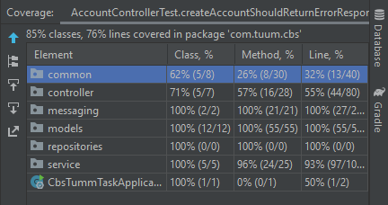

# CBS APP
## A mini Core Banking System

## Table of Contents

- [Features](#features)
- [Building and Running the application](#building-and-running-the-application)
- [Endpoints Overview](#endpoints-overview)
- [Test Reports](#test-reports)

## Features

- **A core banking system**: Make and keep track of monetary transactions.
- **Asynchronous architecture**: Never lose any updates, guaranteed alerts.

## Building and Running the application

1. Navigate to the project root and execute:
   ```bash
   gradle clean build
   ```

2. To run the packaged jar:
   ```bash
   docker build -t cbs .
   ```

3. To build a Docker image for the application:
   ```bash
   docker-compose up --build
   ```

4. To start the application using Docker Compose:
   ```bash
   docker-compose down -v
   ```
   Database tables will be created automatically

## Endpoints Overview

1. To see the API doc use the following [link](http://localhost:8080/swagger-ui/index.html) when the app is running.

2. To see the message queues use the following [link](http://localhost:15672/#/queues) when the app is running.
   Here are the rabbitmq login details (if you're asked for it):
   username: `guest`
   password: `guest`

## Test Reports
   Build test reports can be found on this [page](https://htmlpreview.github.io/?https://github.com/De-Bola/cbs/blob/master/cbs/build/reports/tests/test/index.html)
   
   

   Screenshot of test coverage from intellij

   Coverage test reports can be found on this [page](https://htmlpreview.github.io/?https://github.com/De-Bola/cbs/blob/master/coverage/reports/index.html)